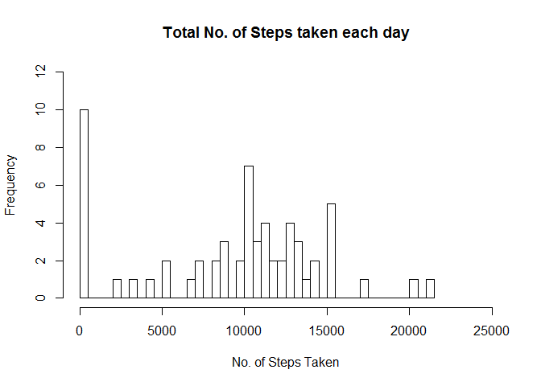
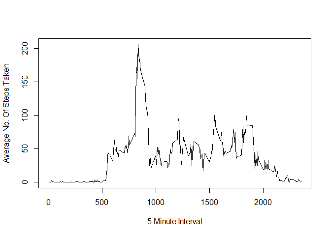
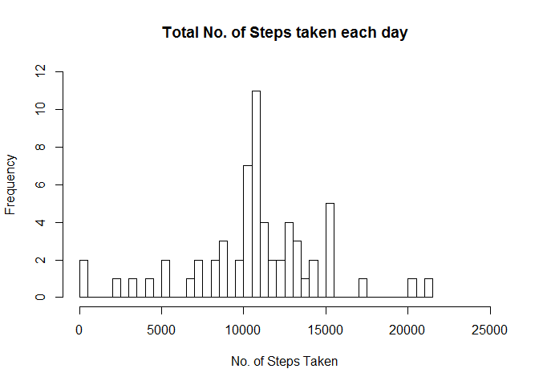
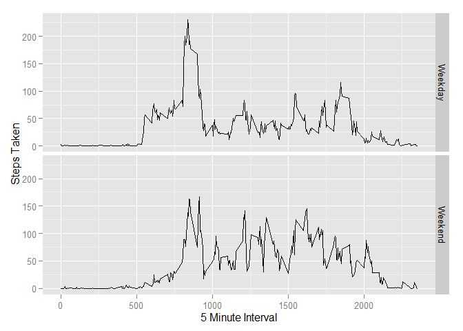

# Reproducible Research: Peer Assessment 1


## Loading and preprocessing the data

```r
library(plyr)
library(dplyr)
library(lubridate)
library(ggplot2)
activityData <- read.csv('./activity/activity.csv')
```

## Total Number of Steps Taken per day

```r
stepsperday <- ddply(activityData, .(date), summarize, sum = sum(steps, na.rm=TRUE) )
```
###Histogram of the total number of steps taken each day

```r
hist(stepsperday$sum, breaks = 61, main = 'Total No. of Steps taken each day', xlab = 'No. of Steps Taken', xlim = range(c(0,25000)), ylim = range(c(0,12)))
```

 

### Mean total number of steps taken per day

```r
mean(stepsperday$sum, na.rm = TRUE)
```

```
## [1] 9354.23
```

### Median total number of steps taken per day

```r
median(stepsperday$sum, na.rm = TRUE)
```

```
## [1] 10395
```


## Average Daily Activity Pattern

```r
stepstaken <- ddply(activityData, .(interval), summarize, avg = mean(steps, na.rm = TRUE))
```

### Time Series Plot of 5-Minute Interval and Average No. of Steps Taken

```r
plot(stepstaken, type= 'l', xlab = '5 Minute Interval', ylab = 'Average No. Of Steps Taken')
```

 

### 5-minute interval containing the maximum number of steps

```r
arrange(stepstaken, desc(avg))$interval[1]
```

```
## [1] 835
```


## Imputing missing values

### Total number of missing values in the dataset`

```r
sum(!complete.cases(activityData))
```

```
## [1] 2304
```

### Strategy for filling in all of the missing values in the dataset
Missing values in any interval is replaced by mean for that 5-minute interval.

### New dataset that is equal to the original dataset but with the missing data filled in

```r
data <- activityData
for ( i in 1 : nrow(data)) {
  if ( is.na(data$steps[i]) ) {
		data[i,'steps'] <- as.integer(filter(stepstaken, interval == data[i,'interval'])$avg[1])
	}
}
```
### Total number of steps taken each day with missing values filled in 

```r
stepseachday <- ddply(data, .(date), summarize, sum = sum(steps, na.rm=TRUE) )
```

### Histogram of the total number of steps taken each day with missing values filled in

```r
hist(stepseachday$sum, breaks = 61, main = 'Total No. of Steps taken each day', xlab = 'No. of Steps Taken', xlim = range(c(0,25000)), ylim = range(c(0,12)))
```

 

### Mean of the total number of steps taken each day with missing values filled in

```r
mean(stepseachday$sum)
```

```
## [1] 10749.77
```

### Median of the total number of steps taken each day with missing values filled in

```r
median(stepseachday$sum)
```

```
## [1] 10641
```


## Finding any differences in activity patterns between weekdays and weekends

```r
d1 <- data
d1$date <- ymd(d1$date)
isWeekday <- function(x) {
  if ( weekdays(x) %in% c('Saturday','Sunday') ) {
		'Weekend' 
	}
	else {
		'Weekday'
	}
}
l1 <- sapply(d1$date, isWeekday)
d1 <- cbind(d1, factor(l1))
names(d1)[4] <- 'day'
d2 <- ddply(d1, .(interval, day), summarize, avg = mean(steps, na.rm = TRUE))
g <- ggplot(d2, aes(interval, avg)) + geom_line() + facet_grid(day~.) + xlab('5 Minute Interval') + ylab('Steps Taken')
print(g)
```

 
